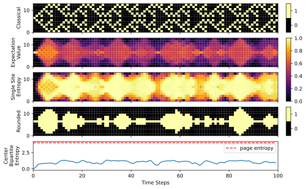

# QuantumGameOfLife.jl

## A Classical Simulation of the Quantum Game of Life


### Usage
List all available parameters with
```bash
julia --project cli.jl --help
```
<br/>

Create a plot
```bash
julia --project cli.jl --initial-states single
```
<br/>

Use different initial state vectors
```bash
julia --project cli.jl --initial-states blinker triple_blinker
```
<br/>

Use different rules
```bash
--julia --project cli.jl --initial-states blinker --distance 2 --activation-interval 2 4
```
<br/>

Write to different file formats
```bash
julia --project cli.jl --initial-states single --file-formats svg png pdf
```
<br/>

<!-- Plot the classical evolution and mps bond dimension
```bash
julia --project cli.jl --initial-states single --plot-classical --plot-bond-dims
```
<br/>

Try the TDVP algorithm (This can take a while)
```bash
julia --project cli.jl --initial-states single --algorithm 2tdvp --num-steps 1000 --plotting-frequency 10 --plot-bond-dims --num-cells 15
``` -->

Plots are saved in the plots directory by default, which can be changed with the --plot-file-path argument.

### Work with the REPL
Julia uses a just-in-time compiler which increases the time to the first plot. Subsequent executions will reuse the compiled functions, saving a lot of time. However, when using the cli script, the compiled functions are lost between executions and have to be recompiled every time. 

To prevent that, you might want to work from inside the julia REPL, especially if you plan to create more than just one plot.
To do that, first open the julia REPL
```bash
julia
```
then include the instantiation file and use the project.
```julia
include("instantiate.jl")
using QuantumGameOfLife
```
<br/>

Afterwards, you can use the same command line options as with the cli by passing them to the start function.
```julia
QuantumGameOfLife.start("--initial-states single --file-formats pdf jpg --plot-sse --plot-rounded")
```
